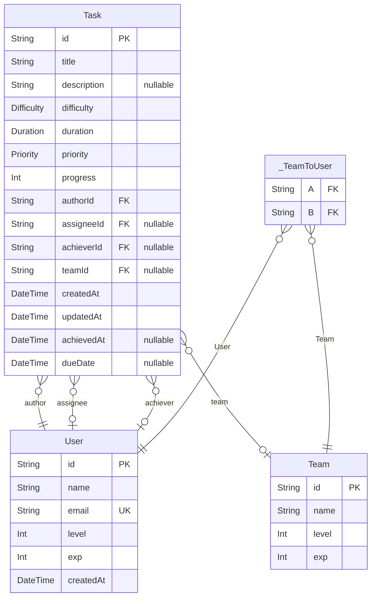

# ER図

> Generated by [`prisma-markdown`](https://github.com/samchon/prisma-markdown)

- [default](#default)

## default

### `User`

Properties as follows:

- `id`:
- `name`:
- `email`:
- `level`:
- `exp`:
- `createdAt`:

### `Team`

Properties as follows:

- `id`:
- `name`:
- `level`:
- `exp`:

### `Task`

Properties as follows:

- `id`:
- `title`:
- `description`:
- `difficulty`:
- `duration`:
- `priority`:
- `progress`:
- `authorId`:
- `assigneeId`:
- `achieverId`:
- `teamId`:
- `createdAt`:
- `updatedAt`:
- `achievedAt`:
- `dueDate`:

### `_TeamToUser`

Pair relationship table between [Team](#Team) and [User](#User)

Properties as follows:

- `A`:
- `B`:
