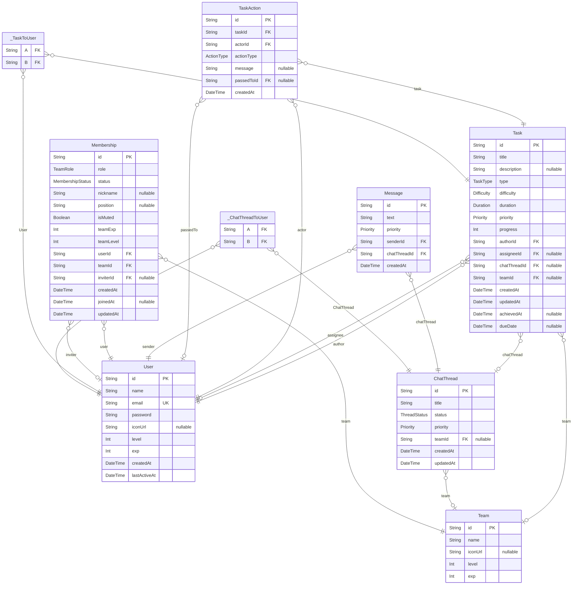

# ER図

> Generated by [`prisma-markdown`](https://github.com/samchon/prisma-markdown)

- [default](#default)

## default

### `User`

Properties as follows:

- `id`:
- `name`:
- `email`:
- `password`:
- `iconUrl`:
- `level`:
- `exp`:
- `createdAt`:
- `lastActiveAt`:

### `Team`

Properties as follows:

- `id`:
- `name`:
- `iconUrl`:
- `level`:
- `exp`:

### `Task`

Properties as follows:

- `id`:
- `title`:
- `description`:
- `type`:
- `difficulty`:
- `duration`:
- `priority`:
- `progress`:
- `authorId`:
- `assigneeId`:
- `chatThreadId`:
- `teamId`:
- `createdAt`:
- `updatedAt`:
- `achievedAt`:
- `dueDate`:

### `TaskAction`

Properties as follows:

- `id`:
- `taskId`:
- `actorId`:
- `actionType`:
- `message`:
- `passedToId`:
- `createdAt`:

### `ChatThread`

Properties as follows:

- `id`:
- `title`:
- `status`:
- `priority`:
- `teamId`:
- `createdAt`:
- `updatedAt`:

### `Message`

Properties as follows:

- `id`:
- `text`:
- `priority`:
- `senderId`:
- `chatThreadId`:
- `createdAt`:

### `Membership`

Properties as follows:

- `id`:
- `role`:
- `status`:
- `nickname`:
- `position`:
- `isMuted`:
- `teamExp`:
- `teamLevel`:
- `userId`:
- `teamId`:
- `inviterId`:
- `createdAt`:
- `joinedAt`:
- `updatedAt`:

### `_TaskToUser`

Pair relationship table between [Task](#Task) and [User](#User)

Properties as follows:

- `A`:
- `B`:

### `_ChatThreadToUser`

Pair relationship table between [ChatThread](#ChatThread) and [User](#User)

Properties as follows:

- `A`:
- `B`:
