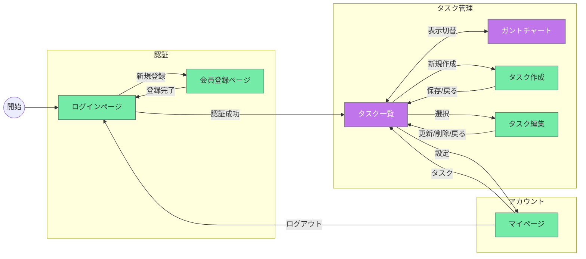

# 画面遷移図

```mermaid
graph LR
    %% style
    classDef primary fill:#C076EA,stroke:#8E7E99,stroke-width:2px,color:#FFFFFF;
    classDef secondary fill:#75EBA8,stroke:#597065,stroke-width:1px,color:#333333;

    Start((開始)) --> Login

    %% 認証グループ
    subgraph Auth [認証]
        Login[ログインページ]
        Register[会員登録ページ]
        Login --> |新規登録| Register
        Register --> |登録完了| Login
    end

    %% 認証->メイン
    Login ---> |認証成功| List

    %% メイン機能
    subgraph WorkSpace [タスク管理]
        List[タスク一覧]
        Gantt[ガントチャート]
        Create[タスク作成]
        Edit[タスク編集]

        List <--> |表示切替| Gantt
        List --> |新規作成| Create
        Create --> |保存/戻る| List
        List --> |選択| Edit
        Edit --> |更新/削除/戻る| List
    end

    %% ユーザー設定は別枠
    subgraph Account [アカウント]
        MyPage[マイページ]
    end

    List --> |設定| MyPage
    MyPage --> |タスク| List
    MyPage ---> |ログアウト| Login

    %% style
    class List,Gantt primary;
    class Login,Register,Create,Edit,MyPage secondary;
```